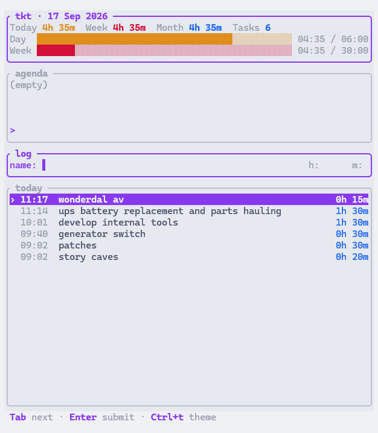

# tkt

Terminal time tracker for personal ticket hours. Pronounced "ticket".



## Install

### macOS / Linux

```bash
curl -fsSL https://raw.githubusercontent.com/Comninos/tkt/master/install.sh | sh
```

Installs to `~/.local/bin` by default. Override with `BIN_DIR=/path curl -fsSL ... | sh`.

### Windows (PowerShell)

```powershell
irm https://raw.githubusercontent.com/Comninos/tkt/master/install.ps1 | iex
```

Installs to `%LOCALAPPDATA%\tkt` and adds it to your user `PATH`.

### Homebrew

After a release is published:

```bash
curl -fsSL https://github.com/Comninos/tkt/releases/latest/download/tkt.rb -o tkt.rb
brew install --formula ./tkt.rb
```

### Scoop

```powershell
scoop install https://github.com/Comninos/tkt/releases/latest/download/tkt.json
```

### Manual

Download the archive for your platform from the [latest release](https://github.com/Comninos/tkt/releases/latest), extract it, and put `tkt` on your `PATH`.

### From source

Requires [Rust](https://rustup.rs) (`cargo`):

```bash
cargo install --git https://github.com/Comninos/tkt --locked
```

## License

[MIT](LICENSE)
